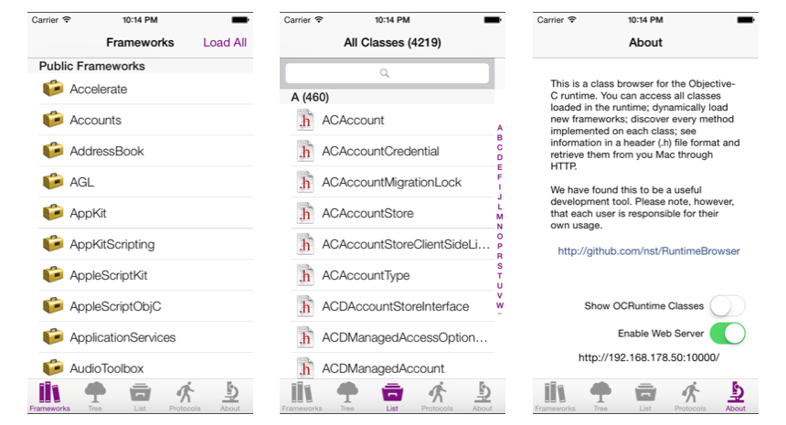
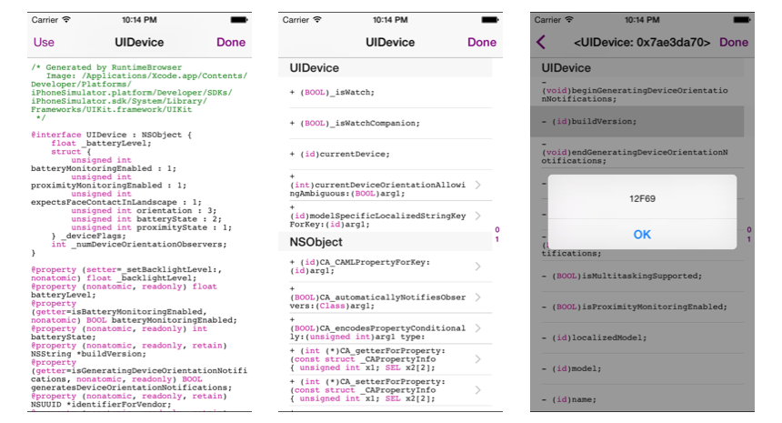

# OCRuntime
OCRuntime

From [RuntimeBrowser](https://github.com/nst/RuntimeBrowser)

###Abstract
This is a class browser for the Objective-C runtime on iOS and OS X. It gives you full access to all classes loaded in the runtime; allows you to dynamically load new modules and their classes; shows every method implemented on each class; and displays information in a header (.h) file format.

We have found this to be a useful development tool. Please note, however, that each user is responsible for their own usage.

The original version was released in April 2002 by Ezra Epstein. The project is maintained by Nicolas Seriot since August, 2008.

You can browse the [iOS headers](https://github.com/nst/iOS-Runtime-Headers) as seen by RuntimeBrowser.

